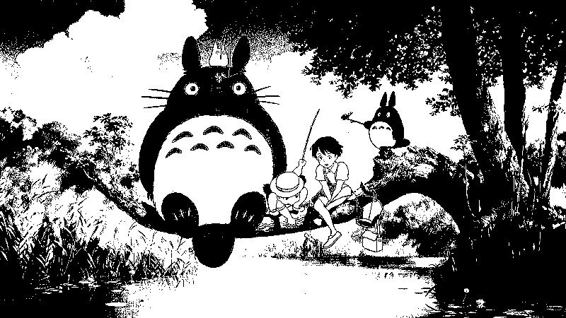
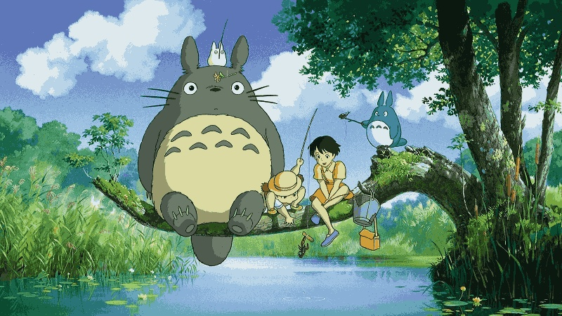
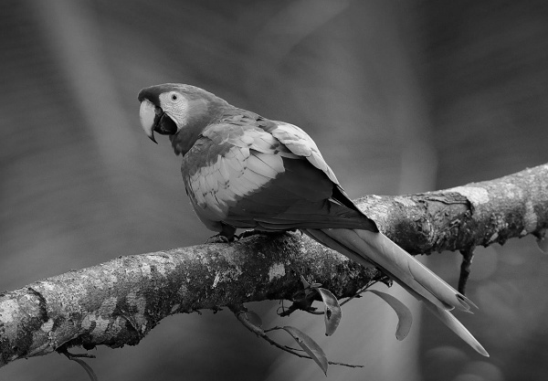
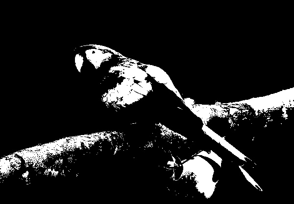
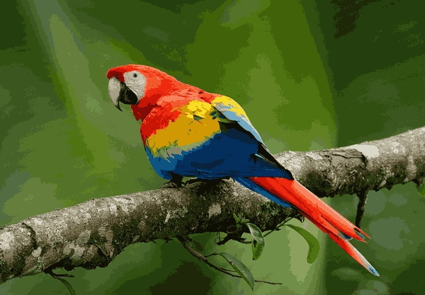
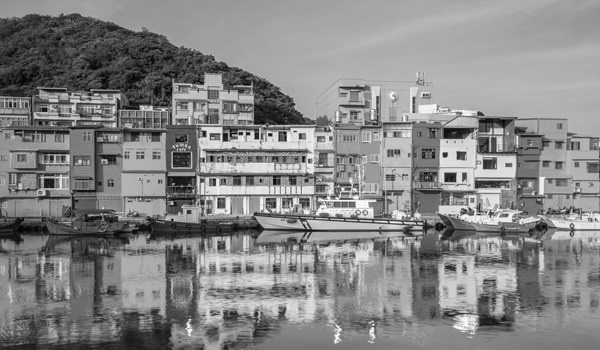
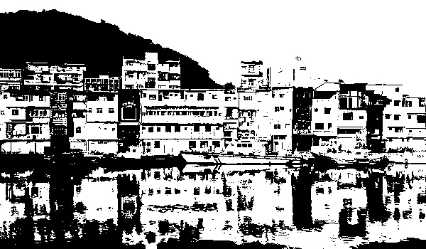
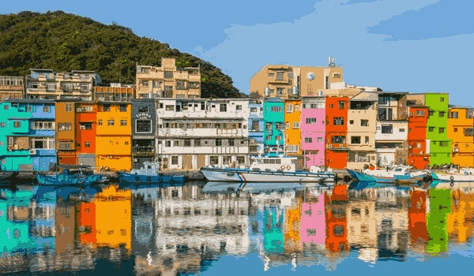

# Machine Vision Homework 1

> *The content of README.md is the same as the PDF. You only need to read one.*

## Identity
- class : 資工三 (CS3)
- name : 鄭重雨 (Chung-Yu, Cheng)
- student ID : 111590002

## Environment setup (for linux)

Please ensure you have python 3.x and venv in your environment, then run these commands:
``` bash
python3 -m venv .venv # create virtual environment
source .venv/bin/activate # activate the virtual environment
python3 -m pip install -r requirements.txt # install all dependencies
```
Then you can run the python file in the folder.

## Techniques used in project

1. K-means clustering (Q1-3, finding 32 colors)
    - K-means clustering is used to reduce the number of colors in the image to 32 by grouping similar colors together.
    - Because K-means determines clusters by averaging the values, similar colors are naturally close together in RGB space. Therefore, using K-means is very suitable for grouping colors.
2. KD tree (Q1-3, find nearest color)
    - KDTree is used to efficiently find the nearest color cluster center for each pixel in the image.
    - KDTree efficiently organizes points in a k-dimensional space (with k=3 for RGB colors) to perform fast nearest neighbor searches when matching each pixel with its closest color.
3. Bilinear interpolation (Q2-2, resizing image)
    - Bilinear interpolation is used to calculate the pixel values in the resized image by considering the closest 2x2 neighborhood of known pixel values surrounding the unknown pixel.

## Program explanation

> *I separate answers into different functions. You can find them in the corresponding classes.*

### Question 1

1. Q1-1 Convert the color image to the grayscale image
    - The code splits the three channels (RGB) of the color image, then applies the formula (V = 0.3R + 0.59G + 0.11B) given in the specification. Finally, round all values in the image to integers.
2. Q1-2 Convert the grayscale image to the binary image
    - I use np.where to separate pixels into two parts, the pixels over the threshold are set to 255, and the others are set to 0.
3. Q1-3 Convert the color image to the index-color image
    - The code uses K-means clustering to reduce the number of colors in the image to 32. Then, it uses KDTree to map each pixel to the nearest cluster center.

### Question 2

1. Q2-1 Resizing image to 1/2 and 2 times without interpolation
    - The code calculates the new dimensions of the image based on the scaling factor and directly maps the pixels from the original image to the new image without any interpolation.
2. Q2-2 Resizing image to 1/2 and 2 times with interpolation
    - The code calculates the new dimensions of the image based on the scaling factor and uses bilinear interpolation to determine the pixel values in the new image.
    - Bilinear interpolation works by taking a weighted average of the four nearest pixel values to estimate the value of a new pixel. In the implementation, I pad the image to ensure that the interpolation does not exceed the image boundaries.

## Images

### img1

- input: 
- grayscale image: 
- binary image: 
- index-color image: 
- downscaled image (plain): 
- upscaled image (plain): 
- downscaled image (interpolation): 
- upscaled image (interpolation): 

### img2

- input: 
- grayscale image: 
- binary image: 
- index-color image: 
- downscaled image (plain): 
- upscaled image (plain): 
- downscaled image (interpolation): 
- upscaled image (interpolation): 

### img3

- input: 
- grayscale image: 
- binary image: 
- index-color image: 
- downscaled image (plain): 
- upscaled image (plain): 
- downscaled image (interpolation): 
- upscaled image (interpolation): 

## Observations and thoughts

1. The use of K-means clustering for color reduction is effective in grouping similar colors together, which helps in reducing the overall number of colors while maintaining the visual quality of the image.
2. I found out that downscaled images remain identical regardless of whether plain mapping or bilinear interpolation is used, likely because when scaling down by a factor of 0.5, the source coordinates are exact integers, resulting in both methods producing the same outcome.
3. Bilinear interpolation produces smoother results compared to the plain mapping when resizing images.
